<head>
  <link rel="stylesheet" href="https://cdnjs.cloudflare.com/ajax/libs/font-awesome/4.7.0/css/font-awesome.min.css">
</head>

<body>

    
        <a href="https://vitalitynectar.onrender.com" style="text-decoration: none;">
        ✩▁▂▃▅▆▓▒░VitalityNectar░▒▓▆▅▃▂▁✩</a>
    

## Concept
. VitalityNectar – Find delicious (Nectar) and energizing (Vitality) smoothies.

• Vitality: This term refers to the state of being strong, active, and full of energy. It’s often associated with good health and vigorous life. In the context of website, it represents the energy and health benefits that come from consuming the smoothies

• Nectar is a sweet liquid produced by plants, particularly within flowers to attract pollinating animals. It’s often associated with something sweet and desirable. In the context of the website, it represents the delicious and appealing fruit smoothies..

## Features
1.	Home page – Explore the captivating realm of blending fruits, vegetables, and other nutritious elements on this page. Create a uniquely delightful taste from preferred ingredients, while simultaneously reaping the dual benefits of enhancing health and well-being

2.	Benefits page – This page highlights the numerous advantages of consuming smoothies crafted from natural ingredients. These benefits include Hydration, Antioxidant intake, Improved Digestion, Promotion of Healthy Sleep, Skin Radiance, Brain Health, and Mood Enhancement, among others. Also, user will find a small explanation of each one.

3.	Smoothies  page – This webpage is brimming with a variety of smoothie recipes. User can learn more about each one and gather the necessary ingredients to make it themselves. Simply hover over each recipe and click the button to get started on smoothie-making journey.

4.	Favourites Page- This webpage will be personalized for each user, featuring their favorite smoothie recipes sent from the main smoothies page. It will serve as a repository for their preferred recipes, with the flexibility to modify their choices at any time

5.	Contact Page - This webpage is split into two distinct sections. The first section is designed for users to provide feedback about the website or contribute additional recipes. The second section is dedicated to facilitating communication with the website’s developers for any other inquiries or purposes.

## Deployment steps on Render.com

### A. Setup Postgres DB Service
1.	Login into Render Dashboard . Select PostgresSQL from New drop down menu.

  

2.	Specify
    - Name of PostgresSQL instance  - “**vitality-nector-db**”
    - Database – **vitalitynectordb**
    - User – **vn1**
    - Select nearest region – **Frankfurt(EU Central)**
    - Make sure Postgres version is **16**
    - Select Instance Type as **Free**
    - Click on “**Create Database**” button

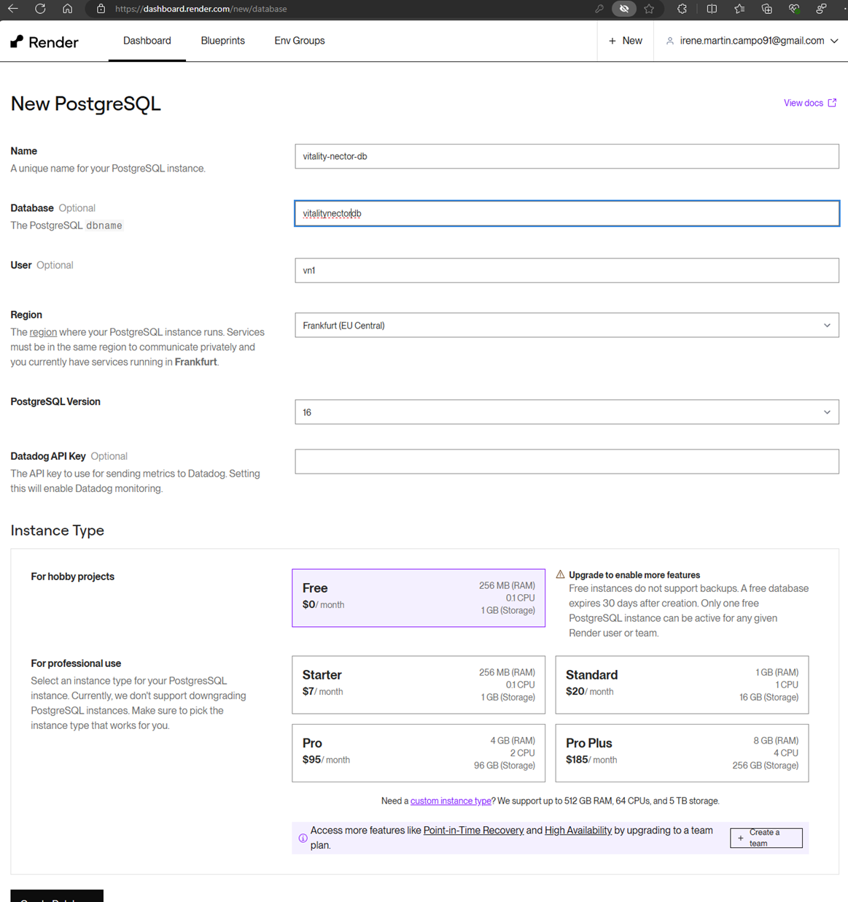

3.	PostgresSQL service will start in some time. Click on **Connect** drop down menu and from **Internal** tab copy **Internal Database URL **

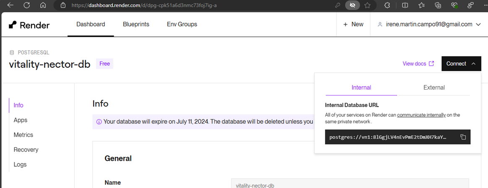

### B. Setup Flask Web Service
1.	Requirement.txt in github repo (https://github.com/Irenetitor/VitalityNectar) mentions package dependencies needed by render.com

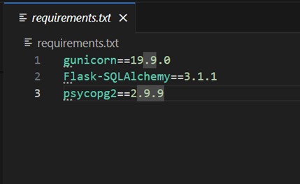

2.	In Render.com, after login into dashboard select **Web service** from **New** drop down menu

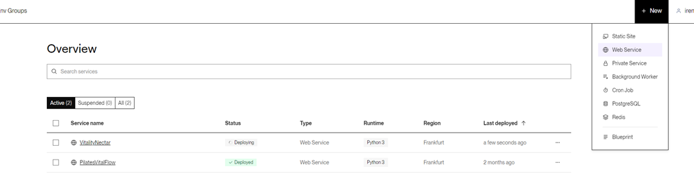

3.	Select option – **Build and deploy from git repository** and click **Next** button

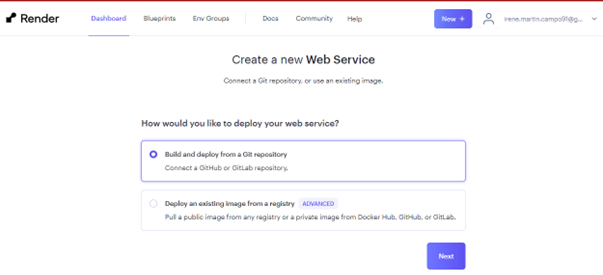

4.	Connect with gitrepo  **https://github.com/Irenetitor/VitalityNectar**

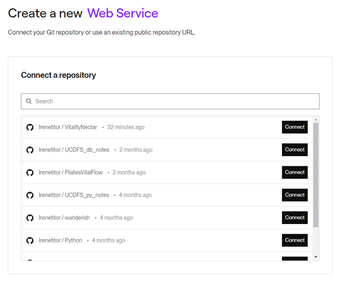

5.	Specify
    - Name for web service instance – **VitalityNectar**
    - Select nearest region – **Frankfurt(EU Central)**
    - Branch for repo as **main**
    - Keep Runtime as **Python 3**
    - Build comment as $ **pip install -r requirements .txt**
    - Start command as $ **gunicorn app:app**
    - Select Instance Type as **Free**
    - **IMPORTANT** – Mention Environment variable** DATABASE_URL** as copied **Internal Database URL** for deployed **PostgresSQL service** before while setup of **PostgresSQL database**.
    - Click on **Create Web Service** button  

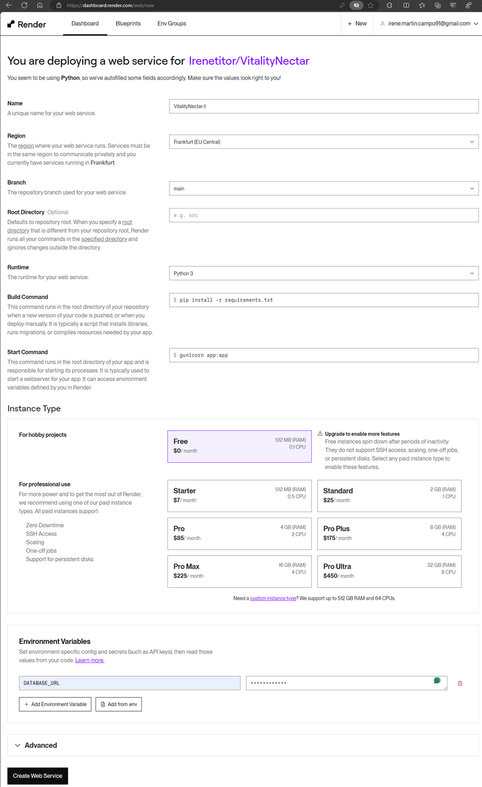

6.	After web service start is successful. Go to https://vitalitynectar.onrender.com to access website

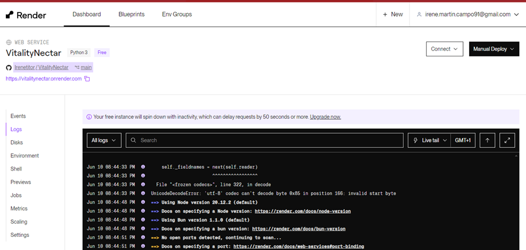

Sample pages from website:

Home Page - 
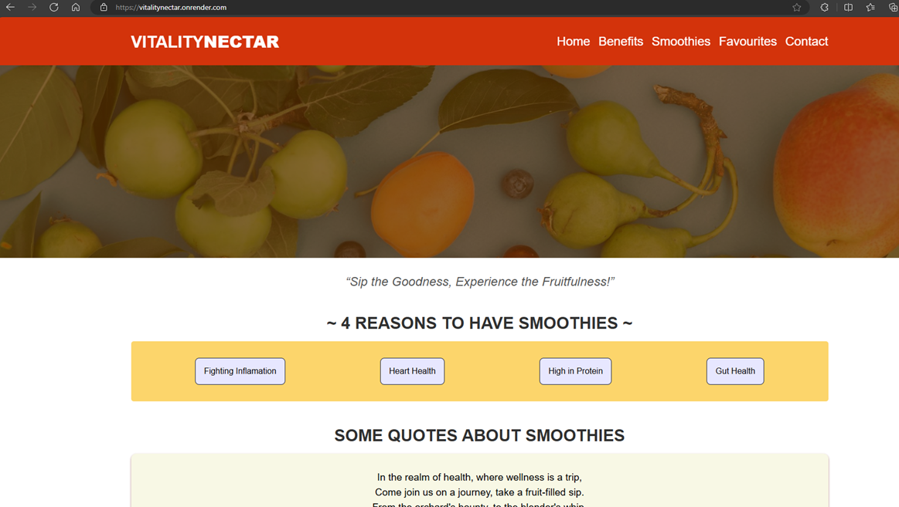

Benefits Page - 
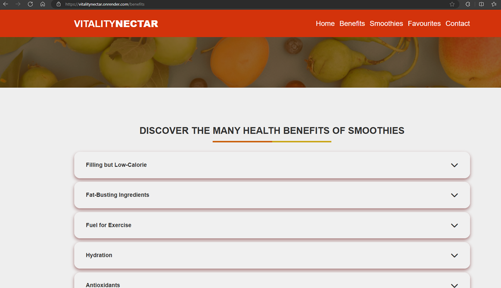

Smoothies Page - 
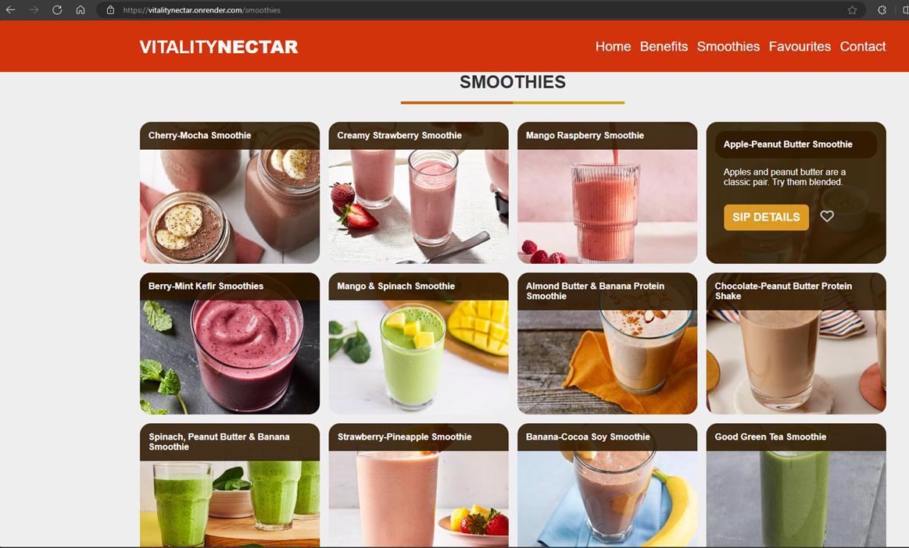

Favourite Page - 
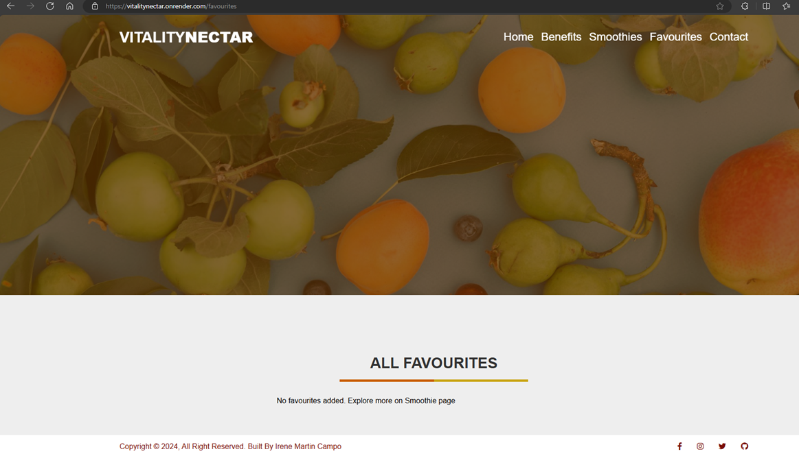

Contact Page - 
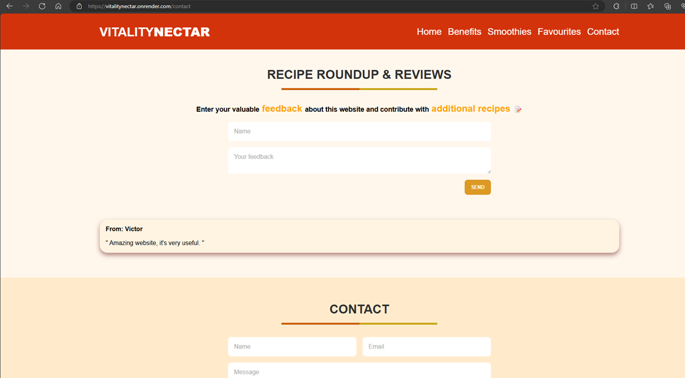

## Instructions to access

Website url - https://vitalitynectar.onrender.com  <i class="fa fa-hand-o-left"></i>

To access this website for desktop, tablet and mobile, different methods depending on the device and browser can be used. Here are some general instructions for each device type:

- For desktop: Use any web browser to access a website by typing its URL in the address bar and pressing Enter.

- For tablet: You can use a web browser app to access a website by typing its URL in the address bar and tapping Go.

- For mobile: You can use a web browser app to access a website by typing its URL in the address bar and tapping Go. 

## Resources

1.	https://www.eatingwell.com
2.	https://www.eatingwell.com/inflammation-fighting-diabetes-friendly-smoothie-recipes-8646840/ 
3.	https://www.eatingwell.com/heart-healthy-smoothie-recipes-8621837
4.	https://www.eatingwell.com/gut-healthy-high-protein-smoothie-recipes-8609875
5.	https://www.eatingwell.com/easy-5-minute-heart-healthy-smoothie-recipes-8418476
6.	https://www.eatingwell.com/gallery/8078505/easy-5-minute-smoothies-help-you-poop/
7.	https://www.eatingwell.com/high-protein-smoothies-to-make-forever-8364481

## License
This project is licensed under the MIT License - see the LICENSE file for details.

<body>